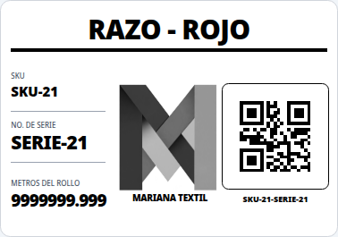
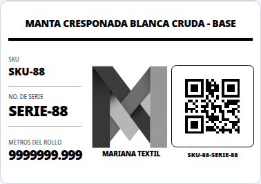

# Verificación — dos decimales y autoajuste de etiquetas

Fecha: 2026-09-01

## Bloque 1 — presentación de cantidades

- Pantallas, documentos y tickets usan `formatNumber(..., { kind: "quantity" })` con dos decimales.
- Excel conserva celdas numéricas y usa `#,##0.00`.
- El CSV de Kardex aplica la misma precisión visible sin separadores de miles que rompan la columna.
- La etiqueta conserva su formateador exacto de tres decimales.
- Caso de precisión: tres líneas guardadas como `1.004` muestran `1.00` cada una, pero el total se calcula sobre `3.012` y se presenta como `3.01`.
- No se modificaron el esquema, migraciones, `DECIMAL(10,3)` ni `quantityTimesMoneyCents`.
- Metros, kilos y bolsas permanecen separados; solo cambió la presentación.

## Bloque 2 — catálogo aprobado completo

Fuente: `attached_assets/catalogo-mariana-textil_1787419404085.xlsx`, hoja `Productos`.

Se renderizaron los 154 productos con el componente real `LabelPrint` en Chromium, después de cargar fuentes y de ejecutar el recálculo de `beforeprint`.

### Nombre del producto

| Escalón | Etiquetas |
|---:|---:|
| 30 px | 103 |
| 24 px | 30 |
| 18 px | 18 |
| 14 px (mínimo) | 3 |
| **Total** | **154** |

- Desbordamientos horizontales: **0**
- Nombres cortados: **0**
- Más corto: `RAZO - ROJO`, 30 px.
- Más largo: `MANTA CRESPONADA BLANCA CRUDA - BASE`, 14 px.

### Metraje

- Valor límite verificado: `9999999.999`.
- Las 154 etiquetas eligieron 19 px.
- Desbordamientos horizontales: **0**.
- El texto conserva exactamente tres decimales.
- Escalones disponibles: 29, 24, 19 y 13 px; 13 px es el mínimo legible.

## Evidencia de impresión

El PDF se generó con media de impresión desde el componente real:

- 154 páginas.
- Cada página mide 282.96 × 198 puntos, equivalente a 100 × 70 mm.

[Descargar PDF de las 154 etiquetas](./evidence/etiquetas-catalogo-real-154.pdf)

### Nombre más corto

### Nombre más largo

