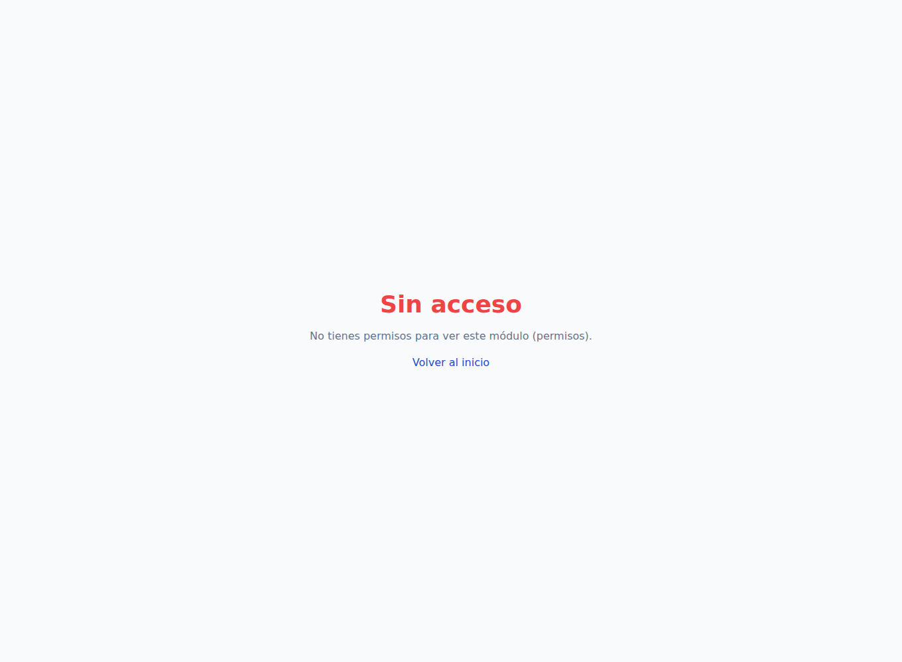
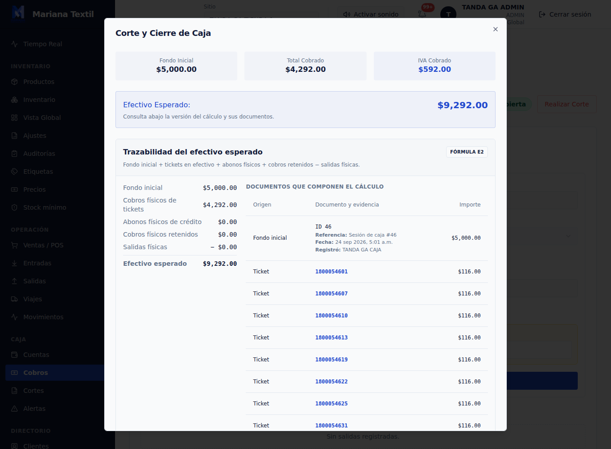

# Tanda G ampliada — informe consolidado

**Estado: PARCIAL en cobertura; cierre operativo completado. Inspección de los dos entregables finales completada.**

La tanda no está completada en su totalidad. No se modificó producto, no se abrieron compuertas y no se aplicaron índices a la aplicación. No se demostró un bypass; esto **no demuestra que no exista alguno**. La liberación solicitada era condicional a encontrar y corregir un bypass: no hay cambio de producto que liberar en esta tanda.

## Alcance y trazabilidad

Requisito: `attached_assets/Pasted-Tanda-G-trabajo-pesado-para-toda-la-noche-Procedimiento_1790223847233.txt`. Pruebas contra copias desechables y actores sintéticos; fuente congelada `ee1bb641e0513b7df18027ad351a72ebbe99af74`, no un checkout histórico independiente de `61d8216`. Build API SHA256 `d4a5a83bbaa5fc130f68217df5da4039d26db325f59345ee2958adabdcc0b0a9`. Las pruebas de servicios no se presentan como cobertura HTTP/UI.

| Tarea | Resultado | Pendiente que impide declarar terminación total |
|---|---|---|
| 1. Permisos | **PARCIAL**, cero bypasses demostrados | 381 celdas sin atribución API directa; 421 sin cierre combinado UI+API |
| 2. Inventario | **PARCIAL**, negativos reproducidos; CHECK ensayado sólo en copia | Cobertura completa de escritores/estados/concurrencia y decisión de adopción |
| 3. Mes simulado | **PASS acotado**, 30 días y 2667 pasos conciliados | No equivale a todos los flujos UI/HTTP ni a volumen comercial observado |
| 4. Rendimiento | **PARCIAL**, pantallas reales sobre 2 s | Estado de cuenta válido, cobro transaccional y atribución SQL de demoras |
| 5. Desconexiones | **PASS acotado**, tres cortes pre-COMMIT | No se probó confirmación incierta de COMMIT ni transporte HTTP |

## 1. Permisos: no inflar cobertura

Sobre **433 celdas residuales**, se ejecutaron **70 solicitudes de operación**, todas denegadas con **403** y sin cambios de negocio observados. Sólo **52 celdas** quedaron cubiertas por la guarda de acción directamente atribuible; **18** fueron interceptadas en fronteras externas. Quedan **381** por cubrir directamente en API.

Se navegaron siete roles naturales —ADMIN, TERMINAL, CAJA, SUPERVISOR, BODEGA, SISTEMAS y CONTADOR—: **77 observaciones rol/página**, **89 capturas**, ocho clics de creación/pestaña y seis aperturas de edición. Hubo doce controles positivos exitosos. Esto no equivale a recorrer todos los botones en todos los estados elegibles.

El cierre estricto de acción **UI+API es sólo 12/433**: quedan **421**. Hay **357 flags sin operación consumidora identificada** cuya semántica debe resolver el propietario; no se les asigna arbitrariamente una ruta ni se infiere que carezcan de efecto. Seis flags legacy siguen tras compuertas E3/E11: las siete sondas separadas recibieron 409 E3 o 403 E11, sin cerrar `clientes_finanzas.crear`.

No se demostró discrepancia explotable pantalla/API en el alcance observado. No hay fundamento para declarar ausencia universal de bypass. Evidencia: `task1/runtime-summary.json`, `runtime-cell-classification.json`, matrices y estados antes/después en `task1/runtime/`.

## 2. Inventario: defecto real y protección propuesta

El mapa estático de escritores está en `tarea-2/inventario-escritores.md`. La comparación pareada final abarca **224 casos de servicio + 56 API**, con y sin CHECK, en dos sitios y METRO/KILO/PIEZA/BOLSA. Además: **92 cadenas** (38 con CHECK y 54 sin él); el preliminar de 224 servicios no se suma como cobertura independiente.

| Caso negativo −2 | Sin CHECK | Con CHECK temporal |
|---|---|---|
| Activar por HTTP, METRO/KILO, ambos sitios | **200**, cantidad actual −2 y RECEPCIÓN −2 | **500**, mantiene PROGRAMADO 10 y sin movimientos |
| Crear entrada directamente, las cuatro unidades | **Acepta negativo** | Rechazo DB |
| Crear/activar rollo directo, METRO/KILO | Acepta negativo | Rechazo DB |
| Crear/activar directo, PIEZA/BOLSA | Rechazo por helper | Rechazo por helper |
| Ajustar directamente, cuatro unidades | Rechazo | Rechazo |

No extrapolar entrada directa a la ruta HTTP, que conserva su guarda propia. Los controles válidos pasaron: 48/48 con CHECK y 44/44 en baseline final. Se ensayaron transferencias, tránsito/recepción, venta/reversión, mostrador, merma y FIFO; reconstrucción de caché invocada no significa comparación completa de todas sus filas. Reactivación de auditoría sólo tiene rechazo sin evidencia válida, no control positivo. Carreras, todos los compuestos y estados imposibles siguen sin cobertura exhaustiva.

**MAIN añadió y retiró sólo en copia** el CHECK `cantidad_actual >= 0`, con evidencia en `operator-add.json` / `operator-drop.json`. Se comprobó protección frente a negativos y atomicidad observada; devolver 500 no es validación amigable.

La prueba real `nonfinite.json` encontró que **NaN cabe en numeric(10,3) y satisface NaN >= 0**. Por ello la propuesta final revisada es `CHECK (cantidad_actual >= 0 AND cantidad_actual <> 'NaN'::numeric)`. **Su expresión se evaluó, pero esta revisión NO se instaló ni se ensayó como DDL.** ±Infinity fueron rechazados por el typmod actual. No presentar el CHECK probado como protección contra todo valor físico inválido.

Adopción pendiente del dueño: inventariar corruptos, preservar evidencia y decidir corrección trazable; ADD normal falla ante negativos, NOT VALID no sanea lo anterior y VALIDATE requiere resolver incumplimientos. No aplicar no-negatividad al ledger: sus salidas negativas son legítimas. Evidencia: `resultado-final.md`, `comparison.json`, `results-*.json`, `chains-*.json`.

## 3. Mes simulado: ejecución fresca terminada

Resultado final aceptado: **30 fechas consecutivas, 23/09/2026–22/10/2026**, tres tiendas y cuatro bodegas, cuatro unidades nativas, PostgreSQL exclusivo del mes. Son fechas de reloj de procesos controlado, no treinta días de tiempo real.

Se ejecutaron **210 entradas, 120 transferencias, 360 tickets de contado cobrados, 360 notas de crédito, 360 abonos, 90 anticipos, 90 salidas E4, 90 tickets cancelados sin cobro y 90 cortes**, con 87 aperturas y tres sesiones iniciales. **2667 pasos** comprobaron antes/después y expectativas independientes.

- Las 28 celdas sitio/producto/unidad concilian **físico = caché = ledger** después de cada paso.
- Por cada unidad, sin sumar magnitudes incompatibles: 560 inicial + 8400 entradas − 1800 ventas = **7160 final**; traslados y cancelaciones netos cero.
- Crédito: 360 cargos por **540000.00**, 450 movimientos ABONO por **−540100.00**, incluidos anticipos; saldo final **−100.00**, saldo a favor.
- **90 cortes únicos, diferencia cero**; 30 sesiones cerradas y 30 fechas por tienda, conservando sus 30 compuertas. Intentos de reapertura rechazados. Sin inversiones de timestamp en el ledger verificado.

El intento anterior de **29 días** está separado en `failed-attempt-clock-resume/`: timeout y error del reloj del arnés al reanudar, **no defecto del producto ni PASS**. MAIN restauró copia fresca y la corrida aceptada empezó desde cero, en tres tramos de diez días. No se reparó historia mediante SQL.

Límites: carga sintética modesta; transferencias inmediatas, no flujo documental completo; cancelación sin cobro, no reembolso; abono por handler real, no cobertura HTTP; arqueos simulados exactos. Evidencia final: `tarea-3/summary.json`, `results.json`, `journal.jsonl.gz`, `cuts.jsonl` y `INFORME.md`.

## 4. Rendimiento: SQL y pantalla no son lo mismo

Escenario anual **supuesto**, no volumen real inferido: 50 tickets × tres tiendas × 365 días; 54,750 añadidos. Totales: **54,753 tickets, 54,765 líneas, 41,064 pagos, 13,691 movimientos de crédito y 90,714 rollos**. Ventas concentradas en un cliente y cuatro productos. Carga bulk SQL de rendimiento, no simulación financiera conciliada ni un año de cierres.

**Ninguna de 126 ejecuciones SQL/builders superó 2 s**; 29 formas con EXPLAIN ANALYZE/BUFFERS. No significa que la UI cumpla. Navegador Chromium real, tres muestras por pantalla:

| Pantalla lista | Muestra 1 / 2 / 3, segundos | Conclusión |
|---|---|---|
| Caja operativa y botón Cobrar | 3.533 / 0.948 / 1.045 | Primera >2 s |
| Inventario agrupado | 1.275 / 0.790 / 1.289 | Tres <2 s |
| Diálogo de corte, efectivo visible | 3.094 / 2.587 / 2.515 | Tres >2 s |
| Reporte Clientes y crédito | 17.280 / 5.607 / 5.844 | Tres >2 s |
| Estado de cuenta E7 | Sin trío válido | **BLOQUEADO en instrumentación** |

Primera muestra no es caché fría real; n=3 no permite un p95 estable. Corte incluye navegación, selección de tienda y apertura del diálogo. Reporte usó mes predeterminado, no filtro anual. Login excluido; recursos externos bloqueados.

El endpoint de reporte tardó **0.478–0.687 s**, no 5–17 s. Ninguna solicitud terminada del corte superó aproximadamente 0.772 s. Compras del cliente respondió 200 en **4.231 s HTTP**, pero **no se perfiló su SQL efectivo**. La consulta responsable de los excesos >2 s está **sin demostrar**: no atribuir latencia DOM o HTTP a una sentencia SQL.

Estado de cuenta tuvo selector legacy inadecuado y luego timeout de login antes de medir con selector corregido; no constituyen fallo funcional demostrado. **No se midió escritura de cobro/pago ni cierre confirmado**. Índices de `proposed-indexes.sql` son candidatos **no aplicados ni mejora validada**. Pendientes: perfil SQL E7/compras, CPU/render, cuenta válida, cobro transaccional y distribución comercial aprobada. Evidencia: `tarea-4/browser-informe.md`, resultados de navegador, `benchmark-results.json` y planes.

## 5. Fallas: rollback real antes de COMMIT

Se terminaron **tres backends PostgreSQL propios** mediante `pg_terminate_backend`, comprobando identidad de proceso/base/rol, transacción abierta y frontera real:

1. Venta: tras actualizar el rollo, antes de COMMIT.
2. Abono efectivo: tras insertar movimiento de crédito, antes de recibo/COMMIT.
3. Cierre: tras marcar sesión CERRADA, antes de auditoría/snapshot/COMMIT.

En los tres, **rollback exacto de tablas de negocio** y reintento exitoso. Dos repeticiones idempotentes —venta y abono— no cambiaron negocio; segundo cierre no se etiqueta idempotente porque se rechaza. Resultado: cero rollos vendidos sin ticket, cero abonos ordinarios sin recibo; cierre con snapshot, fondo 5000 + abono 100 = **5100** esperado. Avances de secuencia no se confunden con pérdida de dinero.

Los dos intentos iniciales de instrumentación están conservados y no son PASS. No se probó COMMIT ambiguo, red HTTP, cobro separado de ticket ni abono asignado a deuda previa: el abono quedó a favor. Evidencia: `tarea-5/evidence.json`, `invariants.json`, `resultado.md`.

## Capturas reales seleccionadas

El HTML autocontenido incorpora sólo dos capturas originales verificadas visualmente, no recreaciones ni imágenes de tablas generadas. La selección evita datos restaurados y actores reales; los nombres visibles de la captura de corte son actores sintéticos TANDA GA. No se aplicaron máscaras ni recortes.

Las tareas 2, 3 y 5 conservan evidencia ejecutable/SQL/JSON; no se inventan capturas de UI para pruebas que no la utilizaron.

## Commits por tarea (títulos reales)

- **T1:** `d9bc283` — test(task1): inventory 433 residual permission cells without inflating coverage; `b9f17df` — test(task1): execute natural-role denials and seven real browser sessions.
- **T2:** `5338beb` — test(inventory): prepare isolated negative-quantity matrix and writer audit; `1928627` — test(inventory): execute disposable producer matrix and prepare owner CHECK operator; `558220d` — test(inventory): verify copy CHECK API and broader inventory chains; `55ff4b4` — test(inventory): finish baseline API comparison and nonfinite physical probes.
- **T3:** `849dd99` — test(tanda-ga): prepare isolated 30-day producer workload and document clock blocker; `2c06e23` — test(tanda-ga): record 29 real monthly days and clock-resume blocker; bound stages; **`058c3c5` — test(tanda-ga): complete fresh 30-day seven-site workload with 2667 reconciled steps**.
- **T4:** `d3aff9f` — reports: benchmark isolated annual synthetic workload for G task 4; `2614165` — reports: add real-browser performance timings and bounded E7 blocker.
- **T5:** `7e8be94` — test: prove isolated real disconnect rollback for sale abono and close.

## Cierre operativo y decisiones pendientes

**Restauración informada por MAIN:** workflows de aplicación restaurados a las 05:32:21, PID API 17005, arranque de inspección con los mismos builds; no fue una liberación de producto. Hubo previamente un reinicio de runtime que había detenido los workflows.

**Teardown completado el 24/09/2026 a las 05:38 UTC.** `setup/month-stop.json` registra validación del PID propio 16045 y parada ordenada mediante pg_ctl. MAIN ejecutó después `lifecycle.mjs teardown --remove` y terminó el wrapper. `setup/teardown-final.json` confirma eliminación de la raíz privada —copias, dump, credenciales y secreto temporal— y ausencia de escucha en los **12 puertos** 55442, 55443, 43851–43855 y 43861–43865. Los builds de aplicación se conservaron; MAIN comprobó **health HTTP 200 después de la limpieza**. Se preservó la evidencia documental. El handoff de setup es histórico, marcado **HISTORICAL_DESTROYED**, no una instrucción de ejecución vigente.

También queda pendiente de MAIN la revisión privada integral de artefactos auxiliares antes de distribuirlos: seleccionar capturas seguras no certifica las 89 capturas ni todos los JSON/DOM archivados. No publicar credenciales, cadenas de conexión ni nombres de actores restaurados. Este consolidado no los reproduce.

**Privacidad de los entregables finales:** texto y dos capturas seleccionadas inspeccionados; sin PII de actores restaurados. Comparación privada exacta, sin imprimir valores, contra 20 valores sensibles de credenciales de workers y secreto de sesión temporales: **cero coincidencias en 21,289 archivos**, incluidos textos de reports, evidencia comprimida y archivos de los commits nuevos. No se consultaron secretos de la aplicación real. Este control no sustituye la revisión nominal/visual integral de los auxiliares.

Decisiones del propietario: semántica de 357 flags, alcance adicional de permisos, adopción de restricciones físicas y tratamiento de corruptos, representatividad anual e instrumentación restante. **No “misión cumplida”; no RELEASE de producto requerido.** El cierre de infraestructura no cierra las brechas de cobertura indicadas por tarea. `INFORME.html` es la versión descargable autocontenida de este informe único.